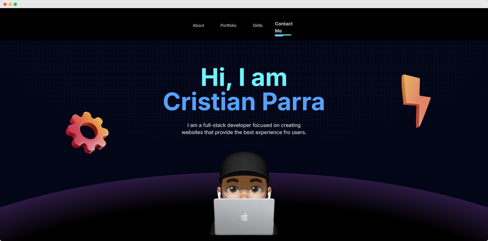
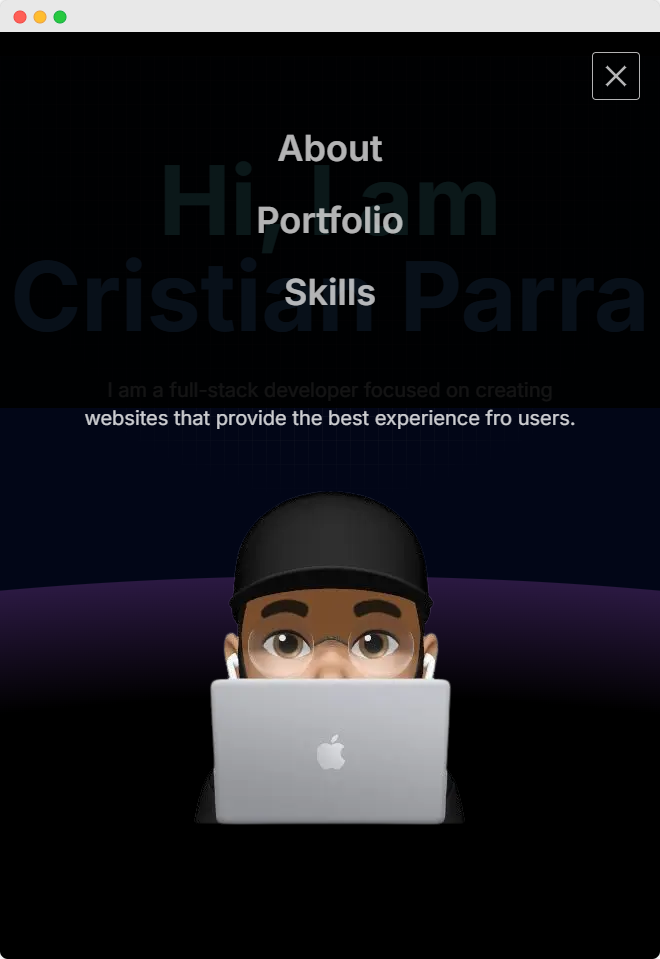
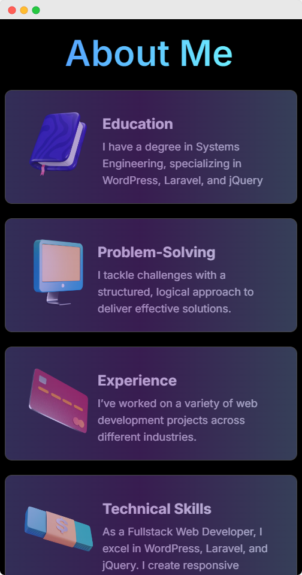
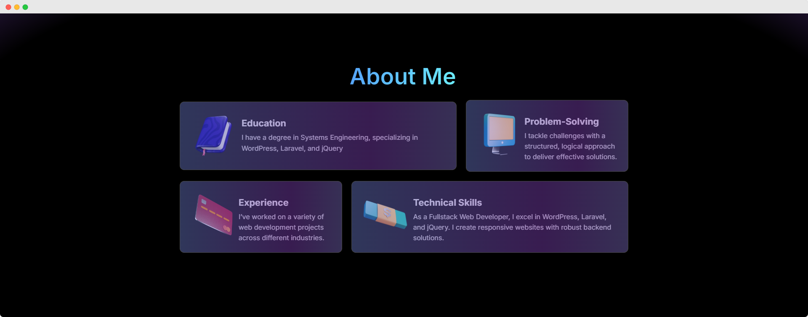
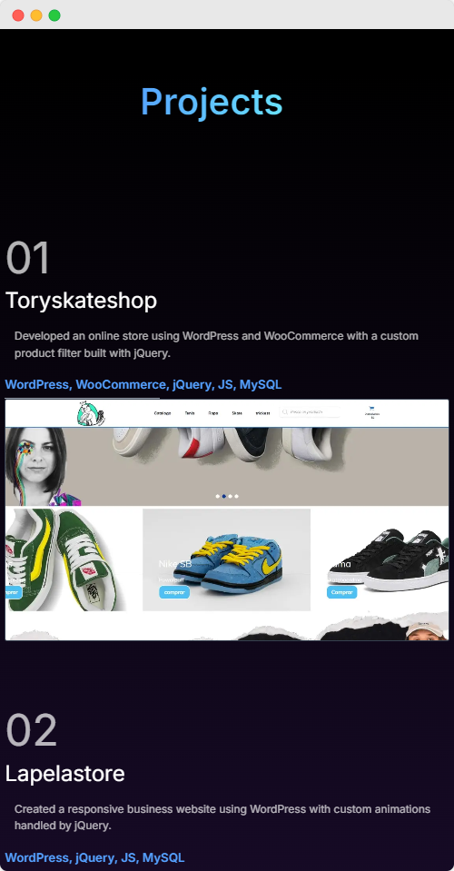
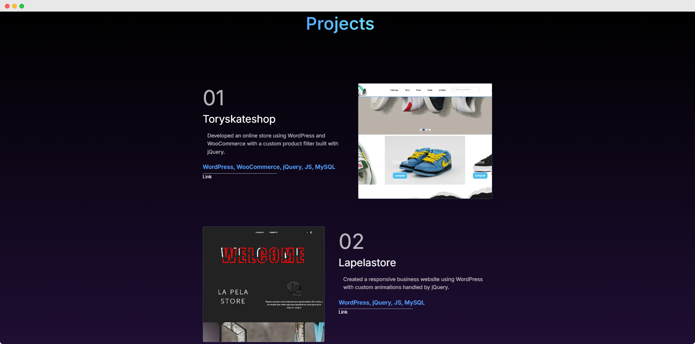
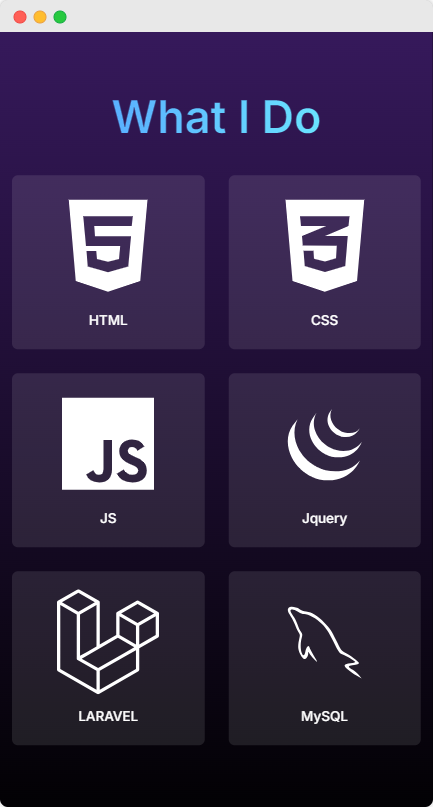
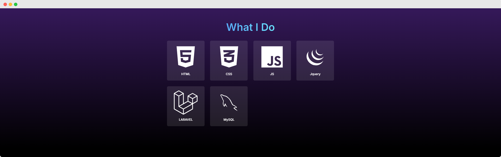
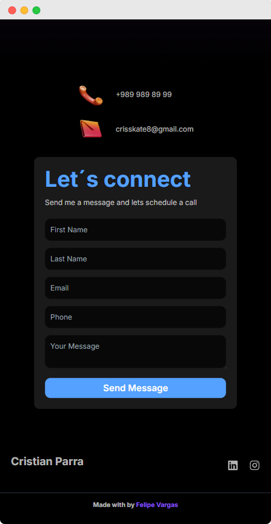

# <span style="color: #0396a1;">Portfolio Cristian Parra</span>

Este es un proyecto de portafolio personal desarrollado en Next.js para mostrar las habilidades, proyectos y experiencia profesional de Cristian Parra. El sitio tiene un diseño moderno, responsivo y cuenta con animaciones interactivas.

## <span style="color: #0396a1;">Tecnologías Utilizadas</span>

#### El portafolio fue construido con las siguientes tecnologías:

| **Next.js** | **JavaScript** | **Tailwind CSS** | **TypeScript** | **Framer Motion** |
|:-----------:|:--------------:|:----------------:|:--------------:|:-----------------:|
|  |  |  |  |  |

## <span style="color: #0396a1;">Demo</span>

Explora el proyecto en vivo en [cristian-parra.vercel.app/](https://cristian-parra.vercel.app/)

## <span style="color: #0396a1;">La demo incluye:</span>

- Diseño adaptable a dispositivos móviles y de escritorio
- Animaciones sutiles y fluidas utilizando Framer Motion
- Navegación intuitiva y rápida

## <span style="color: #0396a1;">Características</span>

- **Diseño Responsivo**: Adaptado para verse bien en dispositivos móviles y de escritorio.
- **Componentes Reutilizables**: Utiliza componentes de React para una fácil personalización.
- **Integracion de Motion**: Utilizado para dar animaciones simples y elegantes.

## <span style="color: #0396a1;">Capturas de Pantalla</span>

### Navbar Section y Hero Section

<div style="display: flex; justify-content: space-around; align-items: center; gap: 20px;">
  <div>
    <strong>Mobile</strong><br/>
    
  </div>
  <div>
    <strong>Desktop</strong><br/>
    
  </div>
</div>

### About Section
<div style="display: flex; justify-content: space-around; align-items: center; gap: 20px;">
  <div>
    <strong>Mobile</strong><br/>
    
  </div>
  <div>
    <strong>Desktop</strong><br/>
    
  </div>
</div>

### Portfolio Section
<div style="display: flex; justify-content: space-around; align-items: center; gap: 20px;">
  <div>
    <strong>Mobile</strong><br/>
    
  </div>
  <div>
    <strong>Desktop</strong><br/>
    
  </div>
</div>

### Skills Section
<div style="display: flex; justify-content: space-around; align-items: center; gap: 20px;">
  <div>
    <strong>Mobile</strong><br/>
    
  </div>
  <div>
    <strong>Desktop</strong><br/>
    
  </div>
</div>

### Contact Section y Footer Section
<div style="display: flex; justify-content: space-around; align-items: center; gap: 20px;">
  <div>
    <strong>Mobile</strong><br/>
    
  </div>
  <div>
    <strong>Desktop</strong><br/>
    
  </div>
</div>

## <span style="color: #0396a1;">Cómo Ejecutarlo Localmente</span>

### Instalación y Uso

Si deseas explorar el código fuente y ejecutar este proyecto en tu entorno local, sigue estos pasos:

### 1. Clona el repositorio

```bash
git clone https://github.com/JonathanVargas0111/portfolio-orange
cd portfolio-orange

```
### 2. Instala las dependencias e inicia el servidor de desarrollo
Después de clonar el repositorio, instala las dependencias del proyecto y ejecuta el servidor de desarrollo. Esto te permitirá ver el portfolio en tu navegador local.

```bash
npm run dev
# or
yarn dev
# or
pnpm dev
# or
bun dev
```

Una vez iniciado, abre [http://localhost:3000](http://localhost:3000) en tu navegador para ver el proyecto en acción. Este entorno de desarrollo te permite realizar cambios y ver las actualizaciones en tiempo real.


## ¡Mantente en Contacto! 🌐

Si te ha gustado este proyecto y te interesa seguir explorando más sobre mi trabajo y contenido, te invito a conectarte conmigo a través de mis redes sociales y a visitar mi sitio web. Estoy siempre abierto a recibir tus comentarios, preguntas o cualquier tipo de retroalimentación. ¡Tu opinión es muy valiosa para mí!

Puedes encontrarme en las siguientes plataformas:

- **📱 Twitter**: [@felipevargasx_](https://twitter.com/felipevargasx_)
- **📸 Instagram**: [@felipevargasx](https://www.instagram.com/felipevargasx)
- **🔗 LinkedIn**: [Jonathan Felipe Vargas Arias](https://www.linkedin.com/in/jonathan-felipe-vargas-arias) — Ingeniero de Sistemas y Desarrollador Web
- **🌍 Sitio Web**: [Felipe Vargas — Desarrollador Web](https://www.felipevargas.com)
- **✍️ Medium**: [@felipevargasx](https://medium.com/@felipevargasx) — Artículos y Tutoriales de Desarrollo Web

¡Espero verte en alguna de mis redes sociales o en mi sitio web! No dudes en comentar, hacer preguntas o compartir tus pensamientos sobre este proyecto. Siempre estoy interesado en conocer las opiniones de la comunidad.
